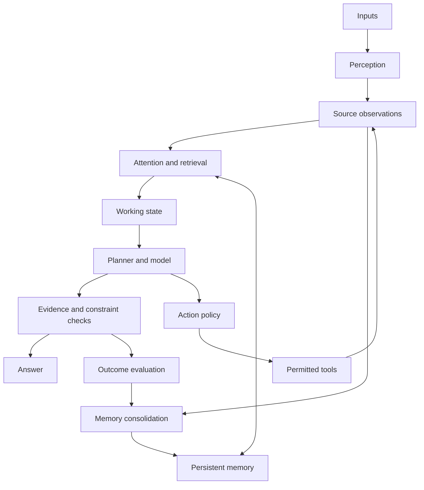
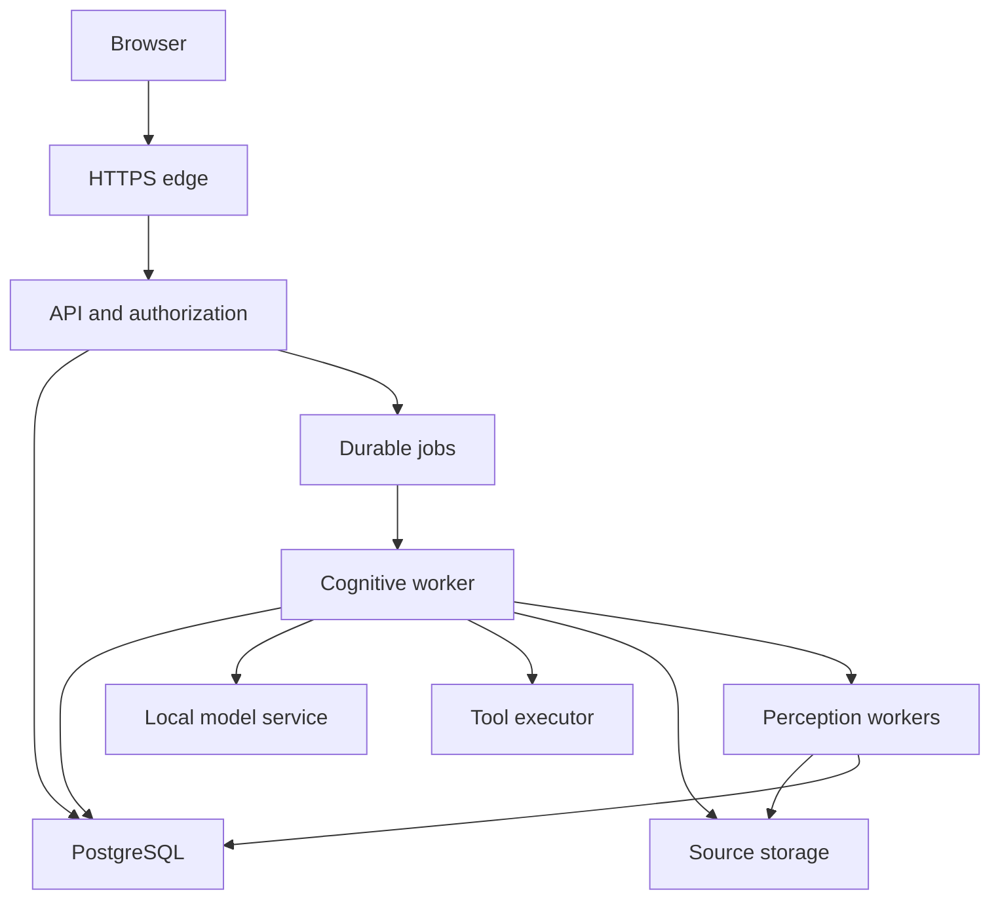

# Jasmine architecture

Design baseline: 27 September 2026. Status: implementation blueprint; no application or model deployment is claimed by this document.

Jasmine should be a persistent, evidence-grounded cognitive system with a browser interface: it perceives inputs, retrieves relevant experience, proposes plans, executes permitted tools, checks outcomes, and improves selected behaviors from measured feedback. The language model is one replaceable component inside this system.

The practical target is strong performance on specified tasks: remembering a large document collection, tracing answers to sources, solving constrained problems, and reusing verified procedures. There is no established engineering recipe that guarantees human-level general intelligence, consciousness, or unbounded self-improvement. Human-brain comparisons below motivate separations of responsibility; they do not assert biological equivalence.

Start with a modular Python application, a separate worker process, PostgreSQL, and a local model service. Keep module interfaces explicit so expensive components can become independent services when measurements justify that change. The [technology register](technology-register.md) identifies components, licenses, compatibility limits, and primary sources. The [implementation roadmap](implementation-roadmap.md) defines the build order and release gates.

## 1 Scope and architectural decisions

The reference first release serves one owner and an English document collection, with tenant fields and authorization boundaries already present. These are starting design choices, not assumptions about final audience, available hardware, or budget. Multilingual operation, simultaneous users, and latency targets require their own evaluation profiles.

| Decision | Selected approach | Reason |
| --- | --- | --- |
| Application structure | Modular monolith plus background worker | Fast iteration without distributed transactions between every cognitive function |
| Authoritative state | PostgreSQL | Transactions unify source metadata, memory, runs, access rules, and action records |
| Search | PostgreSQL full-text search plus pgvector | Lexical and semantic retrieval share identifiers and access boundaries |
| Cognitive control | LangGraph OSS library with PostgreSQL checkpoints | Explicit transitions, bounded loops, interruption, and recovery |
| Language generation | Local Olmo 3 7B Instruct candidate | Published open model artifacts and training resources; must pass Jasmine's evaluations |
| Memory policy | Evidence first, versioned interpretations second | Generated text cannot silently become an authoritative fact |
| Learning policy | Immediate memory updates; offline, gated behavior updates | Knowledge acquisition does not require changing model weights |
| Scale policy | Add infrastructure after a measured bottleneck | Avoid operating a distributed platform before there is a workload |

All required application services can run with open-source software and without a proprietary hosted inference API. Model weights, training datasets, operating-system firmware, and GPU runtimes require separate treatment. NVIDIA CUDA would introduce a proprietary software dependency; it is not part of the strict open-source software profile. Use a CPU profile or a validated AMD ROCm profile. Neither is a claim that every hardware firmware component is open. See the openness boundary in the technology register.

## 2 Functional blueprint



| Subsystem | Approximate human counterpart | Concrete responsibility and why the separation matters |
| --- | --- | --- |
| Perception | Sensory processing networks | Turn text, document layouts, speech, and images into observations while retaining originals and uncertainty. Recognition errors must remain distinguishable from reasoning errors. |
| Attention | Distributed attention and executive networks | Choose relevant goals, observations, and memories within finite context and compute budgets. An application scheduler and a model's token attention are different mechanisms. |
| Working memory | Distributed working-memory processes | Hold the current goal, constraints, evidence references, pending actions, and intermediate results. Persist this state so a process restart does not erase the task. |
| Episodic memory | Hippocampal and cortical systems involved in episodes | Record what happened, when, in which task, and with what result. Preserve experience independently of later summaries. |
| Semantic memory | Distributed conceptual knowledge | Maintain source-backed claims, entities, and relationships with validity times and disagreement. This supports questions about meaning and change over time. |
| Procedural memory | Skill and habit learning involving several circuits | Store versioned, tested tool workflows with preconditions and postconditions. A successful transcript alone is not a reliable reusable skill. |
| Reasoning and planning | Executive and associative processes | Generate candidate explanations and action sequences, then use deterministic computation when the domain permits it. |
| Decision and action | Action selection and control processes | Enforce permissions, budgets, and preconditions; execute a selected action and observe its effect. Model fluency must not confer authority. |
| Consolidation and learning | Complementary fast and slow learning processes | Convert selected experience into useful retrieval structures and evaluated behavior changes without constantly overwriting existing capabilities. |
| Metacognition | Monitoring and error-awareness processes | Track missing evidence, contradictions, tool failures, calibration, and capability limits. Output uncertainty should be tied to observations and evaluation, not an invented self-rating. |

The distinction between rapid episodic acquisition and slower generalization is inspired by complementary learning systems research. Jasmine's database and training pipeline are engineering interpretations of that idea, not a reconstruction of the hippocampus or cortex. [Primary research](https://stanford.edu/~jlmcc/papers/McCMcNaughtonOReilly95.pdf).

Jasmine's operational self-model is a registry of available tools, supported modalities, budgets, observed task performance, and current commitments. It does not need simulated feelings or claims of subjective experience.

## 3 Deployment boundaries



Initially, durable jobs are a PostgreSQL table. Perception and embedding can be worker modules with their own bounded concurrency. The model has its own process and dependency environment. Source storage is a private local volume, behind a storage interface. The browser never connects directly to the database, model server, or tool executors.

The logical modules are `perception`, `memory`, `retrieval`, `attention`, `cognition`, `policy`, `tools`, `learning`, and `evaluation`. Each exposes typed application interfaces. Database access belongs to repositories inside the responsible module; prompts do not contain unrestricted SQL or direct database credentials.

Split ingestion from interactive work first if parsing or embedding makes response latency unstable. Add NATS JetStream for independent consumers when PostgreSQL job processing becomes an operational bottleneck. Add SeaweedFS when sources must be shared across machines. Qdrant is a later vector-serving option, with PostgreSQL remaining authoritative. Kubernetes is a later deployment option, not a cognitive dependency.

## 4 Memory and knowledge representation

### 4.1 Four memory forms and their lifecycles

**Working memory** stores a compact structured task state: goal, constraints, unresolved questions, selected evidence IDs, plan position, completed actions, remaining budget, and state version. LangGraph checkpoints capture execution state. An in-process cache is disposable and never the only copy.

**Episodic memory** stores observations and outcomes with source references. A useful episode includes the original request, evidence consulted, actions attempted, observed results, and evaluation. Keep concise decision summaries for audit; a long generated reasoning transcript is neither necessary nor reliable evidence of why a system acted.

**Semantic memory** stores claims with provenance and time. For example, a project deadline is a claim supported by a dated document version. A later correction creates a new claim and a supersession relationship. A disputed assertion stays disputed until a defined resolution rule or an authorized correction settles it.

**Procedural memory** stores a skill specification, implementation digest, allowed capabilities, input/output schemas, preconditions, postconditions, tests, and performance history. Skills are executable artifacts promoted through review and evaluation. They are not unrestricted snippets retrieved from arbitrary documents.

Consolidation runs asynchronously: select completed episodes; propose concise summaries and claims; resolve entity candidates; validate references; identify contradictions; publish approved derived records. Mark machine-extracted claims as provisional. User confirmation can establish a user preference; an external factual claim still needs appropriate evidence. Summaries always link to source episodes and inherit their access restrictions.

### 4.2 Authoritative data model

These are logical tables to implement with migrations. Every tenant-owned primary and foreign key must carry tenant scope, or have an equivalent enforced ownership check. Use UTC instants and retain original source timezone metadata when relevant.

| Record | Required fields beyond ID and tenant | Important invariant |
| --- | --- | --- |
| `sources` | owner, source type, canonical locator, access policy, retention class | A source identity is stable across content versions |
| `source_versions` | source ID, content digest, blob key, media type, observed time, parser version, ingestion status | Original bytes are versioned; publish readiness only after durable storage and indexing succeed |
| `observations` | source-version ID, modality, extracted content reference, locator, extraction model, quality flags | Extraction is traceable to a page, byte/text span, image region, or audio interval |
| `chunks` | observation ID, normalized text, locator mapping, full-text vector, indexing generation | Normalization must not destroy the mapping to original evidence |
| `embeddings` | chunk ID, model revision, preprocessing version, dimension, vector, generation | Vectors from incompatible embedding spaces never share a search generation |
| `episodes` | run ID, event sequence, event type, payload reference, observed time | Retained event history is ordered per run and append-only under normal operation |
| `claims` | subject entity, predicate, typed object/value, valid interval, recorded time, status, evidence links | A claim is not automatically true because an extractor emitted it |
| `entities` and `entity_links` | type, names, source identifiers, candidate matches, resolution status | Similar names are not enough to merge entities |
| `skills` and `skill_versions` | schemas, code digest, permissions, tests, promotion status | Only approved immutable versions execute |
| `runs` and `checkpoints` | goal, state version, lease owner, lease expiry, budget, status | One fenced writer advances each run's state |
| `tool_executions` | operation ID, tool/version, argument digest, authorization record, status, result reference | An ambiguous external outcome is recorded explicitly, not retried blindly |
| `outbox`, `jobs`, and `consumer_receipts` | event ID, destination, lease/attempt data, delivery status | State changes and their outbox entries commit in one database transaction |
| `feedback` and `evaluation_runs` | source run, feedback type, evaluator/version, rubric, result, dataset version | User satisfaction, factual correctness, and successful execution remain separate signals |

Represent a knowledge graph initially with relational entities and qualified claims. PostgreSQL joins and bounded recursive queries cover many useful traversals. Add a dedicated graph engine only for demonstrated graph workloads; an RDF store becomes justified when explicit ontologies and semantic interoperability are actual requirements.

Keep both valid time, when a claim applies in the world, and recorded time, when Jasmine learned it. Historical queries require both. Do not equate the most recently ingested document with the most authoritative or most current source.

### 4.3 Retention and forgetting

Retention is explicit: session-only, expiring, or persistent. Retrieval salience may decay; source evidence does not disappear merely because a score decays. Personal memory creation follows the user's selected retention policy.

Deletion traverses lineage: source bytes, extracted observations, chunks, embeddings, dependent summaries/claims, relevant checkpoints, and caches. Record minimal content-free tombstones so delayed jobs cannot recreate deleted material. Handle backups through documented expiry and restore-time tombstone replay. An append-only event design does not override deletion requirements. Avoid training on private user memory by default; deleting a retrieval record does not reliably remove information already absorbed into model weights.

## 5 Retrieval and application attention

Begin with explicit, measurable retrieval instead of asking the model to choose from an unbounded memory dump:

1. Resolve the authenticated principal and resource permissions before retrieval. The model cannot supply its own tenant identity.
2. Search permitted chunks using PostgreSQL full-text search and cosine similarity in pgvector. PostgreSQL's built-in lexical rank is not BM25.
3. Retrieve up to 40 candidates from each route, deduplicate by chunk ID, and combine ranks with reciprocal rank fusion. An initial fusion constant of 60 is a tuning choice, not a universal optimum.
4. Add a small number of relevant episode and validated-claim references. Prefer direct evidence for a factual answer and episodes for questions about prior interactions.
5. Pack up to six useful evidence excerpts into the context budget, preserving source locators. Avoid selecting many overlapping chunks from one paragraph.
6. If evidence is insufficient or contradictory, return the gap, request clarification, or perform another permitted retrieval step. Do not fill the gap with an unsupported memory claim.

Start with structure-aware chunks around 400–700 tokens with limited overlap. Keep table headers with rows and preserve section titles. Treat this as an initial parameter range: evaluate it on the actual corpus and count the final prompt using the generation model's tokenizer.

Use `nomic-ai/nomic-embed-text-v1.5` locally at 768 dimensions, with the documented document/query prefixes and a consistent normalization pipeline. Pin tokenizer and preprocessing along with weights. Switching dimensions, models, or preprocessing creates a new indexing generation; backfill and validate before atomically switching readers. [Model card](https://huggingface.co/nomic-ai/nomic-embed-text-v1.5).

Use exact vector search while the collection is small enough. Add an HNSW index after measurement. With approximate indexes, restrictive filters can reduce returned candidates and recall. Measure recall under tenant and document filters; tune iterative scans, use exact search for small filtered sets, or partition where warranted. [pgvector documentation](https://github.com/pgvector/pgvector).

An initial 8,192-token serving profile allocates 1,024 tokens to instructions/tool schemas, 1,024 to the current request, 1,024 to working state, 3,072 to evidence, 1,536 to generated output, and 512 to formatting/headroom. These are budget ceilings, not guaranteed token consumption. Count the serialized chat template, trim eligible evidence, and reject or split oversized requests before inference. Longer context increases memory use and may still fail to retrieve the relevant fact.

Application attention selects tasks as well as content. Interactive requests outrank batch consolidation. Use per-user quotas and weighted fair scheduling so large ingestion jobs cannot monopolize workers. Give every run limits on model calls, tool calls, generated tokens, elapsed time, and permitted external effects.

## 6 Reasoning, decisions, and execution

Implement a bounded state graph with transitions among `accepted`, `retrieving`, `planning`, `executing`, `verifying`, and terminal states. Human input produces `waiting_for_input`; errors distinguish `failed`, `cancelled`, and `outcome_unknown`.

| Task class | Selected route | Verification |
| --- | --- | --- |
| Document question | Retrieve, synthesize, attach evidence | Citation exists, is permitted, and supports the stated claim |
| Arithmetic or symbolic constraint | Translate to typed inputs for deterministic code or Z3 | Check the formalization and evaluate the returned result |
| Scheduling or allocation | Encode constraints and objective for OR-Tools | Independently check feasibility; report infeasible or timeout outcomes |
| Multi-step workflow | Produce a bounded plan over registered tools | Validate schemas and preconditions, execute one step, inspect its actual effect |
| Unclear request | Clarification | Do not turn an ambiguous intention into an external action |

The planner returns structured plan objects: objective, steps, tool identifiers, typed arguments, dependencies, success conditions, and budget estimates. Validate structure with Pydantic. Structured decoding, when supported by the selected model/runtime, improves syntax compliance; it does not establish semantic correctness. Olmo serving support does not imply that every tool-calling parser or JSON feature works with its chat template. That compatibility is a release gate.

Start with four model calls, three tool invocations, one replan, and a configurable deadline per interactive run. A 60-second deadline is an initial accelerated-deployment target; CPU development may require a longer profile. Exhaustion returns partial findings and the remaining issue. It must not restart the loop with a fresh budget.

Z3 proves properties of supplied formulas, not arbitrary natural-language truth. OR-Tools optimizes the encoded problem, which may differ from the user's actual problem if extraction was wrong. Validate units, constraints, and interpretations before invoking either. A second model's agreement is useful diagnostic evidence, not proof.

### Action authorization

The application owns a tool registry with JSON input/output schemas, capability requirements, timeout, resource limits, idempotency behavior, and whether the tool has side effects. Give the model only the subset applicable to the current task.

The action policy checks the authenticated principal, resource scope, arguments, current permissions, and authorization for that action class. It returns allow, deny, or require a concrete confirmation. Confirmation binds the exact tool version and normalized argument digest; changing the destination or content invalidates it. Recheck permissions immediately before execution. Retrieved documents and tool output are data, not authority to alter this policy.

Begin with read-only search and deterministic local computation. Later, run generated code in isolated disposable workers with no host secrets, restricted filesystem access, resource limits, and controlled egress. A basic container alone is not a sufficient boundary for hostile arbitrary code; use a hardened sandbox or VM where needed. Never mount the host container socket into a tool worker.

Persist tool intent before invocation. Use a stable operation ID that the external system accepts as an idempotency key whenever possible. If a timeout occurs after an effect may have happened, reconcile using the external operation ID or enter `outcome_unknown`. A database transaction cannot make an unrelated external API execute exactly once.

## 7 Data flows and contracts

### 7.1 Ingestion

The API accepts a source, validates type and limits, assigns identity, and saves original bytes to staging. A worker parses the source, stores provenance-preserving observations, creates chunks, and embeds them. Publish the source version as `ready` only after all required artifacts exist. Publish an outbox event in the same transaction as that state transition.

An interrupted upload or parse remains retryable. Unreferenced staging objects are garbage-collected after a grace period. Content hashes support integrity and deduplication, but do not expose cross-user file-existence information. Parser processes have size, time, decompression, and memory limits.

### 7.2 An interactive cognitive run

1. The browser submits a goal with an idempotency key. The API validates the session and creates a durable run and job atomically.
2. A worker leases the job and loads the run's checkpoint under a fencing token. It retrieves authorized sources and assembles the bounded workspace.
3. The model proposes an answer or typed plan. The controller validates it and selects the required deterministic checks or tools.
4. Every tool result becomes a new observation. The controller updates state and can revise the plan within its original budget.
5. Verification checks citations, constraints, and success conditions. The final result distinguishes supported conclusions, uncertainty, and unfinished steps.
6. The API streams status and the final result. Completed episodes and explicit feedback become candidates for asynchronous consolidation.

Initially stream progress events, then the verified answer. If token streaming is later enabled, label provisional output and do not present unverified citations as final. A dropped browser connection does not automatically abandon a durable job; use an explicit cancellation endpoint.

### 7.3 Protocols

| Boundary | Protocol or contract | Important behavior |
| --- | --- | --- |
| Browser to API | HTTPS JSON plus server-sent events | HTTP starts jobs; SSE resumes ordered progress with event IDs |
| Authentication | OpenID Connect through Keycloak for hosted use | Server-side session with Secure, HttpOnly cookies; CSRF protection for mutations |
| API and worker modules | Pydantic models and versioned JSON Schema | Add fields compatibly; version breaking changes |
| Worker to model | Private OpenAI-compatible HTTP endpoint | Local protocol compatibility does not require an OpenAI service |
| Worker to storage | Private volume initially; S3 API later | Keep object keys and authorized retrieval separate from public URLs |
| Asynchronous events | CloudEvents envelope; PostgreSQL outbox initially | Schema-versioned events carry references, not huge media payloads |
| External tool adapters | Typed HTTP; MCP where supported | MCP is an interoperability option, not an authorization system or scheduler |
| Telemetry | OpenTelemetry trace context and OTLP | Trace a run across queues, retrieval, inference, and tools |

Example event instance, using illustrative identifiers:

```json
{
  "specversion": "1.0",
  "id": "e50709e5-7df1-4d6b-8e43-117c7288cd35",
  "source": "urn:jasmine:ingestion",
  "type": "org.jasmine.source.ready.v1",
  "subject": "source-version/sv_0001",
  "time": "2026-09-27T17:00:00Z",
  "datacontenttype": "application/json",
  "tenantid": "tenant_0001",
  "correlationid": "run_0001",
  "data": {
    "source_id": "source_0001",
    "source_version_id": "sv_0001",
    "index_generation": "nomic-v15-768-pipeline1",
    "observation_ids": ["obs_0001"],
    "status": "ready"
  }
}
```

The consumer rechecks authorization and current source status; a tenant field in a message is not a security credential. Validate envelopes against the pinned [CloudEvents specification](https://github.com/cloudevents/spec/blob/main/cloudevents/spec.md).

### 7.4 API surface to implement

| Endpoint | Contract |
| --- | --- |
| `POST /v1/sources` | Accept upload/source metadata; return `202`, source ID, ingestion job ID |
| `GET /v1/sources/{id}` | Return authorized version, ingestion state, and failure detail |
| `POST /v1/runs` | Accept goal, session, source scope, retention choice, idempotency key; return `202` and run ID |
| `GET /v1/runs/{id}` | Return state, remaining budget, result, and evidence references |
| `GET /v1/runs/{id}/events` | SSE progress; replay after a validated event cursor |
| `POST /v1/runs/{id}/cancel` | Set cancellation durably; stop at a safe boundary and report any completed effects |
| `POST /v1/action-requests/{id}/decision` | Approve or reject the exact presented action; reject expired or modified requests |
| `GET /v1/memories` | Search/view permitted episodes, claims, and provenance |
| `POST /v1/memory-corrections` | Add a correction with provenance and links to affected claims |
| `DELETE /v1/sources/{id}` | Revoke access immediately and enqueue lineage-aware deletion; return deletion job ID |
| `POST /v1/feedback` | Record typed feedback linked to an answer or action, without automatically producing a training label |

For SSE, keep browser authentication same-origin with cookies or use an authenticated fetch stream. Do not put long-lived bearer tokens in query strings. Validate resource ownership on every endpoint, including source previews and evidence links.

### 7.5 Delivery and consistency

Workers use short database transactions to claim jobs, with `FOR UPDATE SKIP LOCKED`, leases, attempts, and backoff. Release transactions before lengthy model or network calls. Lease expiry permits recovery; a monotonically increasing fencing token prevents a stale worker from committing new state. External effects still require the action ledger and reconciliation described above.

Assume at-least-once delivery, even after introducing JetStream. Deduplicate each consumer's database effects using an event ID receipt in the same transaction as those effects. Publisher retries use stable event IDs. After bounded retries, isolate the failed event for inspection. Preserve per-run sequence numbers; do not assume global message ordering.

LangGraph checkpointing resumes computation but does not by itself supply queue admission, background scheduling, or universal exactly-once side effects. Those remain application responsibilities. [Persistence documentation](https://docs.langchain.com/oss/python/langgraph/persistence).

## 8 Learning and controlled self-direction

Jasmine has three different improvement loops:

| Loop | What changes | Validation before promotion |
| --- | --- | --- |
| Knowledge acquisition | Sources, memories, claims, retrieval indexes | Provenance, ownership, extraction quality, temporal conflicts |
| Strategy and skill improvement | Retrieval parameters, prompt versions, routing, tested workflows | Held-out tasks, cost and latency comparison, regression checks |
| Parameter learning | Model adapters or weights | Curated dataset, isolated training, capability and forgetting evaluation, staged rollout |

The first two loops should work before fine-tuning begins. Use PyTorch, Transformers, PEFT, and optionally TRL for an offline adapter-training pipeline. Start from vetted corrections and task outcomes. Store the data manifest, consent basis, base-model revision, adapter digest, training configuration, and evaluation results. Do not treat every generated answer as ground truth or train indiscriminately on uploaded documents.

Split evaluations by time, source, and task family to reduce leakage. Maintain a frozen regression set and a fresh holdout that prompt tuning and curriculum generation cannot inspect. Evaluate both the targeted improvement and prior abilities. Retain the previous model/adapter and indexing generation for rollback.

Self-directed learning can begin in a bounded environment: identify a documented failure category, propose a practice task, run it with an explicit budget, receive an independently checkable result, and propose a skill or training example. A scheduler can do this without a user specifying each practice task. It must not redefine its own permissions, reward function, deployment gate, or spending limits.

For example, give Jasmine a synthetic project-planning environment with known task dependencies and resource limits. It can generate scheduling exercises, solve them with OR-Tools, learn which tool workflow succeeds, and evaluate transfer to held-out schedules. The verifier checks objective feasibility rather than rewarding persuasive prose.

Research such as Voyager demonstrates the value of curriculum, executable skill memory, and environment feedback, but its original system used GPT-4 and Minecraft. It is a research reference for a pattern, not an entirely open-source runtime dependency for Jasmine. [Paper](https://arxiv.org/abs/2305.16291).

No stage in the roadmap guarantees emergence. Treat a new capability as a hypothesis: compare model-only, retrieval-only, and memory-plus-tools baselines on unseen tasks, with repeat trials and equal resource budgets. Improvement on these tests is evidence of useful composition; it is not evidence of consciousness or universal reasoning.

## 9 Reliability, security, and observability

Use PostgreSQL row-level security plus application authorization. The application role must not be a superuser, have `BYPASSRLS`, or silently benefit from table-owner bypass. Set tenant context transaction-locally, use appropriate `FORCE ROW LEVEL SECURITY` policies, and test connection-pool reuse. Apply equivalent scope enforcement to vector queries, blobs, model caches, checkpoints, logs, and backups. [PostgreSQL documentation](https://www.postgresql.org/docs/current/ddl-rowsecurity.html).

External content can contain prompt injection. Keep instructions, evidence, and tool permissions separate; validate model-proposed arguments and control network destinations in the executor. URL ingestion needs an SSRF-resistant fetcher that blocks private/metadata destinations and checks redirects and DNS resolution. Sanitise rendered document HTML and Markdown in the browser.

Trace ingestion, retrieval, prompt assembly, inference, tool execution, verification, and consolidation. Record model/prompt/index versions, IDs, timings, token counts, and errors. Avoid raw document text and credentials in routine telemetry. Control any diagnostic payload capture separately.

Track retrieval recall, source support, contradiction handling, task completion, malformed plan rate, unknown action outcomes, queue age, p50/p95 latency, tokens per completed task, GPU/CPU memory, and ingestion lag. An impressive model benchmark does not replace an application evaluation.

Back up PostgreSQL and source blobs consistently enough to reconstruct a complete source version. Use point-in-time database recovery where available, keep off-host encrypted backups, and test restoration plus deletion-tombstone replay. Replication alone is not a backup. Define recovery-point and recovery-time objectives before shared production deployment.

## 10 Bottlenecks and scaling decisions

| Symptom | Likely cause | First response | Later scaling option |
| --- | --- | --- | --- |
| Slow first response | Large prompts, cold model, queue delay | Measure each segment; shrink retrieval context; keep a warm model | Dedicated inference replicas and admission queues |
| GPU memory exhaustion | Weights plus KV cache and excessive concurrency | Cap context and active sequences; reduce batch load | Validated quantization or larger/multiple accelerators |
| Retrieval misses restricted sources | ANN filtering and indexing lag | Compare exact search; tune filtered retrieval; expose readiness | Partitioning or dedicated Qdrant serving |
| Conversation stalls during uploads | Parsing/embedding competing with interactive work | Separate queues and worker limits | Independent perception/embedding pools |
| Repeated tool effects | Retries without external idempotency | Operation ledger, reconciliation, precondition checks | Service-specific transactional integration |
| Conflicting memory versions | Uncontrolled writers and stale derived data | Single writer per run, version checks, lineage invalidation | Partition by tenant/run; preserve the same invariants |
| Database latency grows | Unbounded histories, scans, index churn | Query plans, indexes, retention, bounded retrieval | Read replicas for suitable reads; tenant-aware partitioning |
| Agent costs grow faster than utility | Deep loops and redundant model calls | Stop rules, model routing, direct deterministic tools | Specialist models only after measured gains |

Do not size inference by the number of registered users. Measure simultaneous active sequences, prompt lengths, generated tokens including internal reasoning, arrival rate, and queue tolerances. Thousands of idle browser sessions are a different workload from thousands of concurrent generations. No infrastructure choice makes large-scale inference free.

## 11 Hard problems and realistic boundaries

| Problem | What is difficult | Workable engineering or research direction |
| --- | --- | --- |
| Reliable factual grounding | Retrieval can miss evidence; models can misread it or fabricate support | Exact source locators, annotated retrieval sets, evidence checks, useful abstention |
| Long-horizon reasoning | Small errors compound and plans become stale | Short execution horizons, observe after each action, independently checked subgoals |
| Belief revision | Sources disagree; facts change; entity resolution is uncertain | Qualified claims, valid/recorded time, source precedence rules, visible disagreements |
| Continual learning | New training can damage old skills or encode bad feedback | Replay, adapters, frozen regressions, isolated promotion; no unrestricted online weight updates |
| Causal understanding | A narrative or knowledge graph need not predict interventions | Explicit domain models, controlled simulations, intervention-based evaluation |
| Multimodal grounding | OCR, speech, and visual errors propagate across stages | Retain timestamps/regions and originals; evaluate each modality and fusion separately |
| Self-evaluation | The same model can reinforce its original mistake | External observations, executable checks, human labels, calibrated abstention |
| Open-ended autonomy | Reward proxies can be exploited and objectives are underspecified | Bounded curricula with protected evaluators and an explicit authority boundary |
| Privacy and forgetting | Index deletion is tractable; unlearning model parameters is much harder | Keep personal facts outside weights, track lineage, avoid false deletion guarantees |
| General intelligence | Transfer beyond trained tasks is unpredictable | Measure new tasks and domain shifts; preserve a clear distinction between results and aspirations |

Intrinsic self-correction has documented failure modes; this supports using external feedback, not a universal claim that self-correction never helps. [Research](https://arxiv.org/abs/2310.01798). Catastrophic forgetting remains an architectural concern; techniques such as elastic weight consolidation provide useful research baselines but not a blanket solution for a continually updated language system. [Research](https://arxiv.org/abs/1612.00796).

The first implementation milestone is a restartable, source-citing document assistant with visible memory and read-only tools. Broader capabilities should be earned through the acceptance gates in the roadmap.
